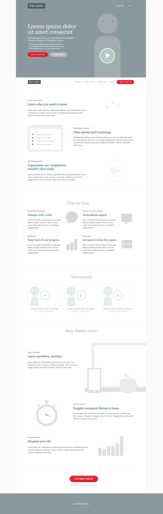
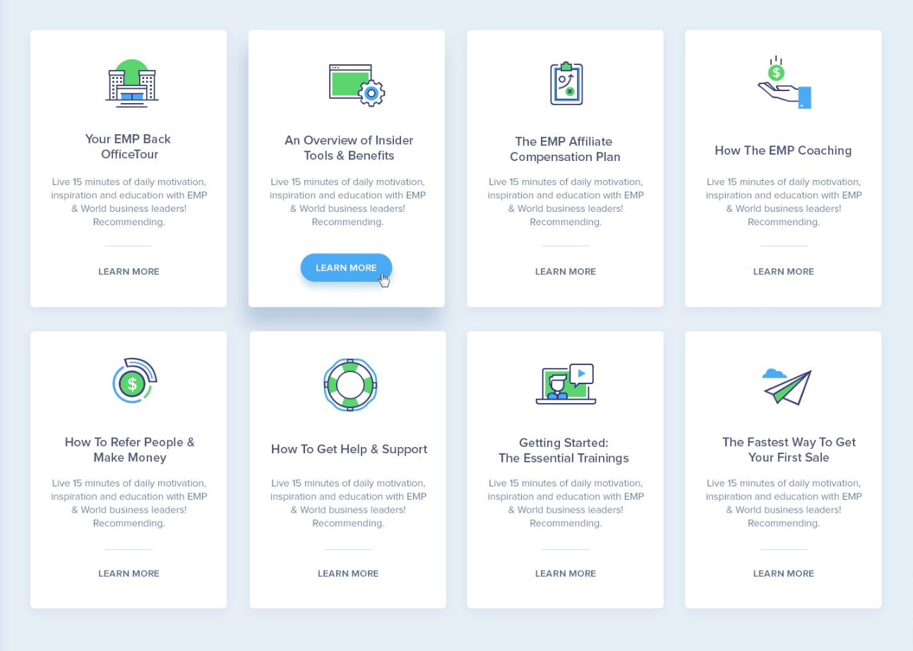

## CSS Framework Challenge

Re-create 2 websites by using a framework of choice

## View Exercises Online

- [Exercise 1](https://mattiasbonte.github.io/css-framework-challenge/index.html)
- [Exercise 2](https://mattiasbonte.github.io/css-framework-challenge/part2.html)

### Exercise 1

### Exercise 2

<b>Built with</b>

- [Visual Studio Code](https://code.visualstudio.com/)
- [Tailwind Framework](https://tailwindcss.com/)

## License

MIT License
MIT © 2020 [WiseCoding](https://github.com/WiseCoding/)
